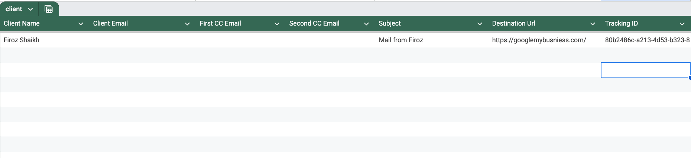
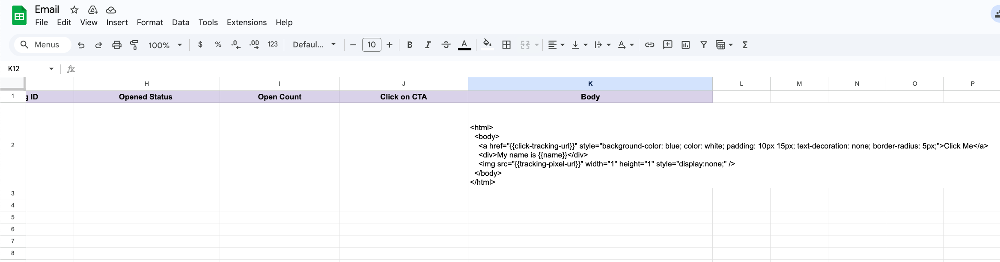
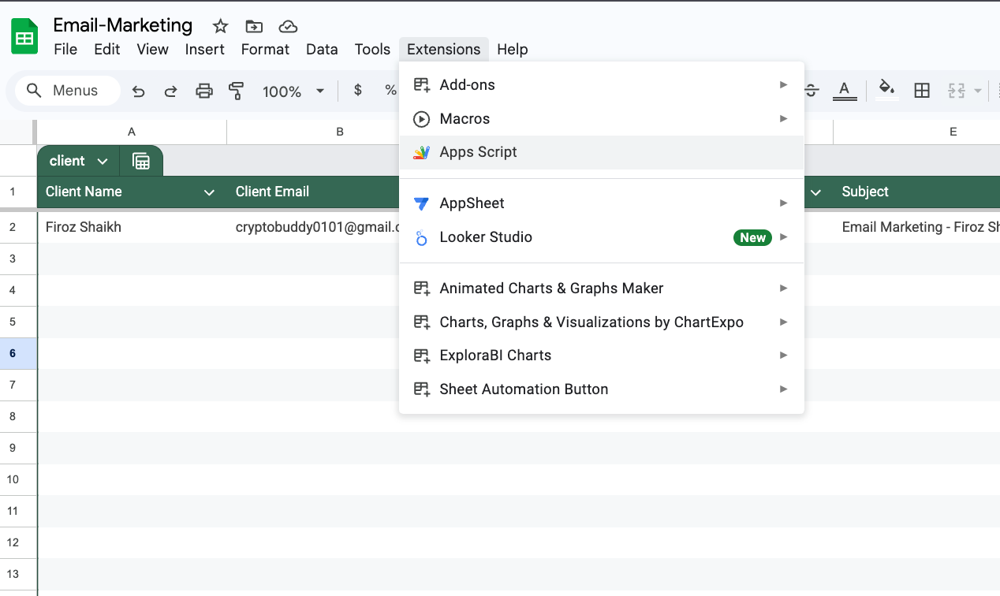
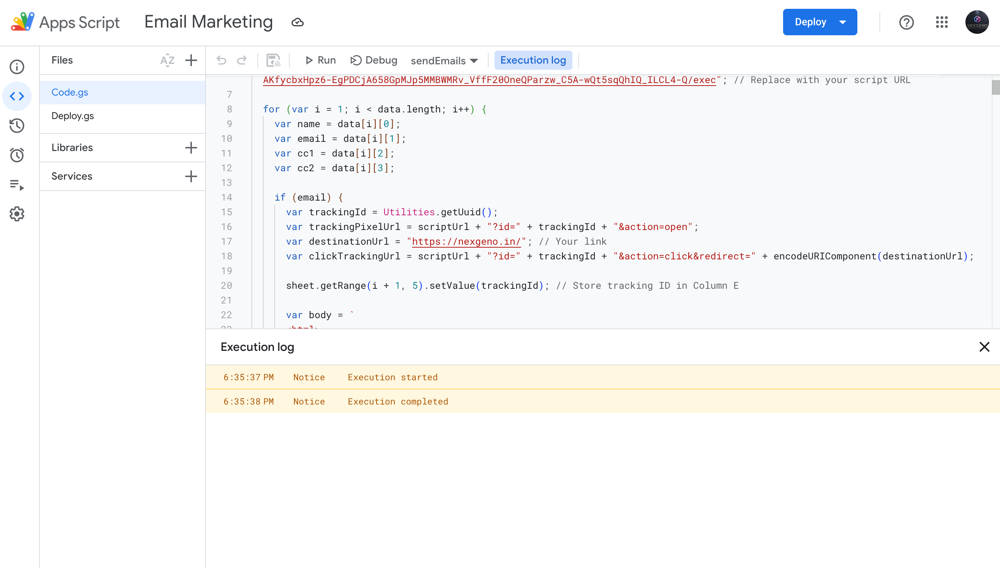
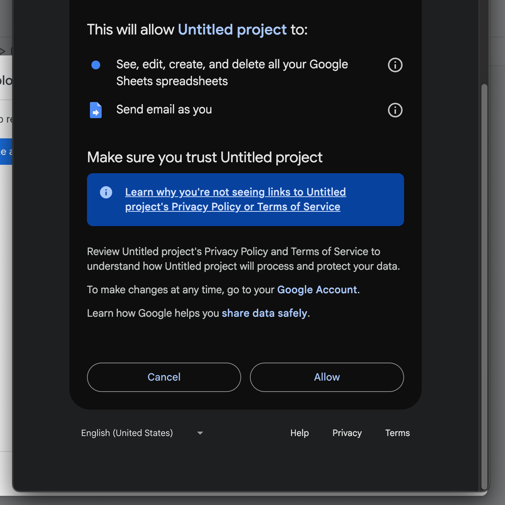
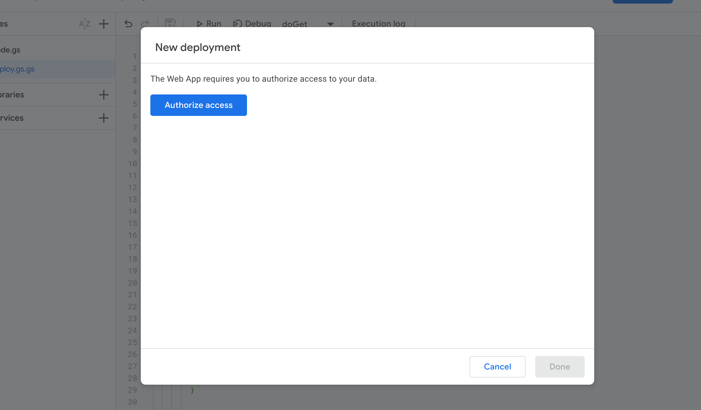
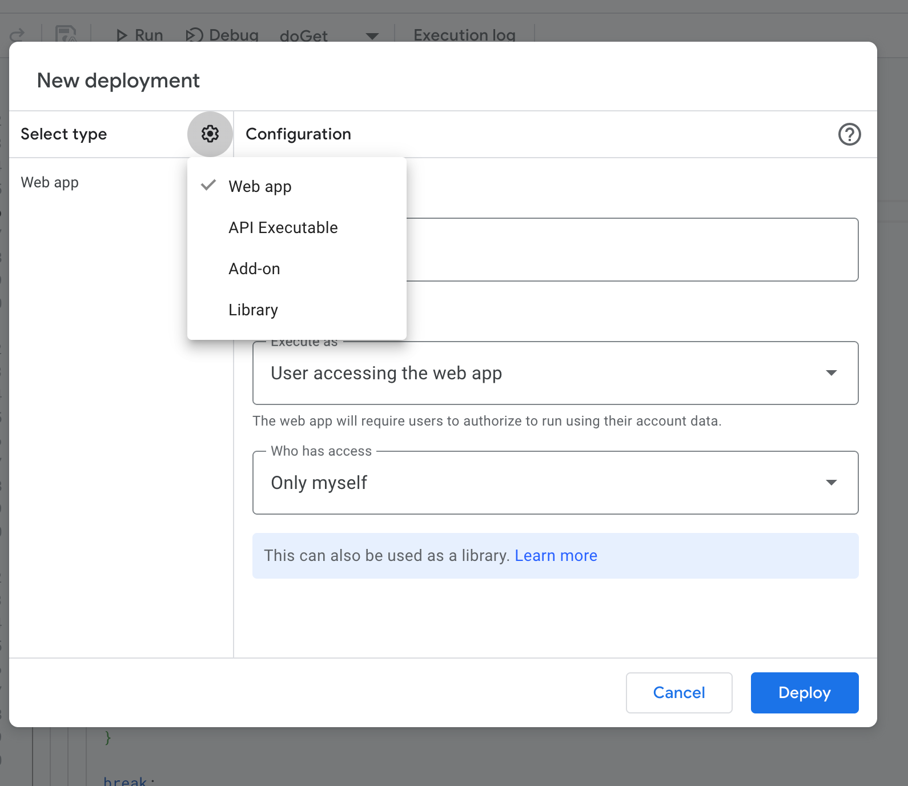

<h1 align="left" style="display: flex; align-items: center;">
  
  Gmail Marketing
</h1>

<p>A lightweight Gmail marketing system powered entirely by Google Sheets and Apps Script. Supports sending up to <b><i> 2,000 emails/days</b> (for professional accounts) or <b>500/day</b> </i> (normal accounts), with real-time tracking for opens, clicks on CTA, and total emails sent — all without any external tools or platforms.</p>

<p align="left">
   &nbsp;
   &nbsp;
   &nbsp;
   &nbsp;
</p>

<br><br>

<p align="center">
  
</p>
<br><br>


> [!NOTE]
> ## Step-by-Step Setup Guide
> Follow these steps to set up and run the email automation system directly from Google Sheets:

---

### ✅ 1. Create Your Google Sheet

- Open [Google Sheets](https://sheets.google.com).
- Add the following columns:  
  `Name | Email | CC | Subject | Message | Status | Opened | Clicked CTA`
  
  
> [!TIP]
> You can customize the columns to include anything else your email system might need.<br>
>
> 
>
> 
> You can - add the Email Body as well from the google sheet itself
>
> 
>

> [!IMPORTANT]
> <p>The {{click-tracking-url}}, {{name}}, and {{tracking-pixel-url}} variables are critically important — <br>they are dynamically replaced at runtime using JavaScript/Apps 
> Script to track email opens and CTA clicks.
> Do not remove or hardcode these — they enable tracking logic in the system.</p> <br><br>
> <pre>  "{{click-tracking-url}}" | {{name}} | "{{tracking-pixel-url}}"  </pre>

---

### 🛠 2. Open Script Editor

- Go to **Extensions → Apps Script** inside your Google Sheet.
- You’ll be taken to the Script Editor (`https://script.google.com/...`). <br><br>
<table>
  <tr>
    <td align="center"><strong>Step 1: Click "Extensions"</strong></td>
  </tr>
  <tr>
    <td></td>

  </tr>
</table>

---

### 📥 3. Add Script Files

- Create two files:
  - `main.gs` (or `code.gs`) — contains your email logic.
  - `deploy.gs` — used to deploy a Web App that tracks events.
<table width="100%" style="table-layout: fixed;">
  <tr>
    <td style="padding: 0; vertical-align: top; width: 33%;">
      
    </td>
    <td style="padding: 0; vertical-align: top; width: 33%;">
      
    </td>
  </tr>
</table>


> [!INFO]
> You can paste the full code provided in this repository into the two different files.

---

### 🚀 4. Deploy the Web App

- In the script editor, go to **Deploy → Manage deployments**.
- Click **New deployment**.
- Select **Web app** and set:
  - **Access**: Anyone
  - **Execute as**: Me (your email)
- Click **Deploy** and copy the **Web App URL**. <br><br>


---

### 🔗 5. Link the Web App URL in Your Script
- Paste the copied Web App URL inside your `main.gs` where the tracking pixel or click URLs are generated.
<pre lang="markdown"> ``` var scriptUrl = ""; // Paste it over here  ``` </pre>
> [!WARNING]
> 
> Do **not** share this URL publicly — it's unique to your tracker.


> ## Paste & Authorize the Script  
> Once you've added the code:  
> - Click the **Run ▶️ button** in the Apps Script editor.  
> - Google will prompt you to **authorize** the script to access your Google account.  
> - Make sure to **review permissions** and click **Allow** so that the script can send emails and interact with your spreadsheet.  <br><br>
> <br><br>
> 🛑 If you skip this, the script will **not execute** and might throw a `permission denied` or `authorization required` error.


---

> [!Tip]
> Professional mail - **1,500 emails/days** <br>
> Gmail account (not Google Workspace), - **500/day**. 
<br>

> [!CAUTION]
> ## Use Responsibly to Avoid Account or Domain Issues  
> Do **not exceed your daily email limits**:
> - **500/day** for normal Gmail accounts  
> - **1,500/day** for Google Workspace (professional) accounts  
>
> ⚠️ If you cross these limits or send poorly formatted/spammy emails:
> - Your account may get **temporarily blocked or suspended**
> - Your domain may get flagged by spam filters (causing low **Domain Authority (DA)** and **Page Authority (PA)**)
> - You might face issues like **DKIM/SPF failures** or emails landing in **spam/promotions tab**
>
> ✅ Always double-check:
> - Your **email syntax** is correct  
> - You're sending to **valid, opted-in recipients only**  
> - You follow **email marketing best practices**

<br>

## 👨‍💻 Author
For questions or support, reach out to:  

- [@buildwithfiroz](https://github.com/buildwithfiroz)
- buildbyfiroz@icloud.com  

